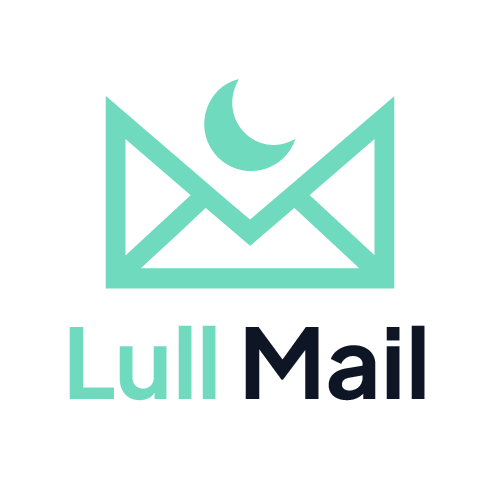

# Lull Mail: AI Email Triage for Windows, macOS & Linux

<picture>
  <source media="(prefers-color-scheme: dark)" srcset="frontend/assets/lullmail-logo-dark.png">
  
</picture>

**Your inbox, on mute.**
Silent by default. Notification by exception. Your data stays yours.

You get 80 emails a day. Three of them actually matter.

Lull Mail is a free, open-source **AI email triage app** for Gmail,
Outlook, iCloud and any IMAP inbox. It runs locally on Mac, Windows
and Linux, connects to your mailboxes, **classifies and summarises**
every message, and ranks what matters, so you only get notified when
something is genuinely urgent. No servers of ours sit between you and
your data: your email goes straight from your accounts to the AI you
choose.

 

## Download

Head to the **[Releases](../../releases/latest)** page and grab the installer for your platform:

| Platform | File | Install |
|---|---|---|
| Windows 10/11 | `LullMail-Setup-X.Y.Z.exe` | Double-click to install |
| macOS 12+ | `LullMail-X.Y.Z.dmg` | Open, drag to Applications |
| Linux | `LullMail-X.Y.Z.tar.gz` | Extract and run `LullMail/LullMail` |

> ⚠️ **Windows · SmartScreen warning.** The installer is not yet
> code-signed. Windows will show *"Windows protected your PC"*.
> Click **More info → Run anyway**. This is expected for now.

> ⚠️ **macOS · Gatekeeper warning.** The app is not yet notarised.
> Right-click → **Open** on first launch to bypass the warning.

The Windows installer drops the app in `%LOCALAPPDATA%\Programs\LullMail`
(no admin prompt). It creates a desktop shortcut, a Start Menu entry,
and registers the app in *Installed apps* for clean uninstallation.

---

## What Lull Mail does

- **Reads for you.** Every email gets classified (important,
  transactional, newsletter, promo, spam) and summarised in two
  lines. Importance score from 1 to 10. You see at a glance which
  message deserves three minutes and which deserves three seconds.

- **Pushes without bothering you.** A push notification only fires
  when something genuinely urgent lands. For everything else,
  radio silence. Your phone gets to be a phone again.

- **Cleans up continuously.** Detects newsletters you haven't read
  in months. Spots the unsubscribe link in one click. Suggests
  automatic rules: move, mark read, delete.

- **Multi-account.** Gmail, Outlook/Microsoft 365, iCloud, Yahoo,
  ProtonMail (via Bridge), and any standard IMAP server.

- **Lives on your machine.** No cloud, no SaaS, no account to create
  with us. It's a native desktop app that talks straight to your IMAP servers.

---

## What Lull Mail is NOT

- **Not a new email client.** Keep using Outlook, Gmail Web, Apple
  Mail. Lull Mail works alongside them, read-only on your mailboxes
  (unless you authorise it to apply rules).

- **Not a new address.** It plugs into your existing accounts.

- **Not a cloud.** Your IMAP credentials never leave your machine.
  See [Privacy](#privacy) below.

---

## Lull Mail vs other approaches

*Lull Mail isn't trying to replace your inbox. It sits in front of it.
Here's how that compares.*

| | Lull Mail | SaneBox | Mailbutler | Hey |
|---|---|---|---|---|
| **What it is** | Native desktop app, layer over your accounts | Cloud service, sorts into IMAP folders | Plugin for Outlook / Apple Mail / Gmail | Standalone email service with new address |
| **Keep your existing address** | Yes | Yes | Yes | No (`@hey.com` required) |
| **Where your emails live** | Your machine (local SQLite) | SaneBox servers + your IMAP | Your provider + Mailbutler cloud for AI | Hey servers |
| **Pricing** | Free with local AI, or pay your own OpenAI usage (~$0.15 / 100 emails) | $7–36 / month | $5–30 / month | $99 / year, flat |
| **Works offline (browse synced mail)** | Yes | No | Partial | No |
| **Open source** | Yes (GPL v3) | No | No | No |
| **Platforms** | Windows, macOS, Linux | Any IMAP client | Outlook, Apple Mail, Gmail web | Web, iOS, Android, macOS |
| **Telemetry on your emails** | None | Per their privacy policy | Per their privacy policy | Per their privacy policy |
| **Replaces your email client** | No | No | No (it embeds) | Yes |

---

## Quick start

1. Download and run the installer (see [Download](#download) above).
2. The setup wizard walks you through three steps: pick your AI
   (local models bundled in the installer, or your own OpenAI key),
   mail accounts (one-click app-password shortcut for Gmail, Outlook,
   iCloud, Yahoo), and *(optional)* push notifications via
   [ntfy.sh](https://ntfy.sh).
3. The first sync fetches the 500 most recent emails per mailbox.
   After that, new mail is triaged in real time.

Full walkthrough: [`docs/GETTING-STARTED.md`](docs/GETTING-STARTED.md).

---

## Privacy

Lull Mail is built around a simple principle: **what can stay on
your machine, stays on your machine.**

| Data | Where it lives |
|---|---|
| IMAP credentials (app password) | OS keyring (Windows Credential Manager / macOS Keychain / Linux Secret Service). `config.yaml` only holds an opaque `keyring:user@host` reference. |
| OpenAI API key *(if you use OpenAI)* | OS keyring (same as above). |
| Local AI models *(if you use local mode)* | GGUF files in your data directory, `models/`. Downloaded on demand from Hugging Face. Never re-uploaded anywhere. |
| Downloaded emails, summaries, scores | Local SQLite. Windows: `%APPDATA%\LullMail\data\mail.db` · macOS: `~/Library/Application Support/LullMail/data/mail.db` · Linux: `~/.local/share/LullMail/data/mail.db` |
| Attachments | Same data directory, `data/attachments/` (UUID filenames, owner-only permissions, integrity-checked on every download) |

**The only outbound flows**:

- **Local AI (default)**: nothing leaves. The analyzer and drafter
  run on your CPU via `llama_cpp.server`. Emails are processed
  in-process, never sent over the network.
- **OpenAI** *(opt-in)*: if you switch the AI provider to OpenAI
  in Settings, every email's text (subject + body) gets sent for
  analysis. Configurable: disable AI analysis for specific
  mailboxes or change the model.
- **ntfy.sh**: *(optional)* push notification title (email subject
  + summary excerpt) is sent to the anonymous topic you choose.
  No link to your identity.
- **Your provider's IMAP**: to fetch your email. Direct, no
  middleman.
- **GitHub Releases API**: once every 6 h to check for a newer
  Lull Mail version. The check sends nothing about you, just a
  GET on the public releases feed.

**Erase everything**: *Settings → Storage → Delete my data* wipes
config + SQLite + attachments + keyring entries in one click.

**Anti-phishing & sandbox**: emails are rendered in a sandboxed
iframe that **never executes JavaScript**, remote images are
**blocked by default** (per-sender opt-in), suspicious links
(homograph, punycode IDN, userinfo trick, raw IP, shorteners,
suspicious TLDs, typosquat, subdomain spoofing) route through a
warning page before opening, and SPF/DKIM/DMARC verdicts are
surfaced as a coloured badge on every email. See
[`docs/SECURITY-ROADMAP.md`](docs/SECURITY-ROADMAP.md) for what is
still planned (E2E PGP, AV system integration, signed installer).

---

## Quick FAQ

**How much does it cost?**
Free with the default local AI: the models run on your machine and
cost nothing once downloaded. Switch to OpenAI in Settings if you
prefer cloud quality (you pay OpenAI directly, ~$0.15 / 100 emails).
Push notifications go through ntfy.sh, also free.

**Does it work offline?**
Yes for reading what you've already synced. No for fetching new mail
or running the AI on it. Both need the network.

**Can I drop it overnight?**
Yes. Lull Mail is read-only on your mailboxes by default and doesn't
register itself anywhere on your system. Uninstall and delete your
data directory (Windows: `%APPDATA%\LullMail`,
macOS: `~/Library/Application Support/LullMail`,
Linux: `~/.local/share/LullMail`). Nothing stays behind.

**Which platforms?**
Windows 10/11, macOS 12+, and Linux. Download the right installer from
the [Releases](../../releases/latest) page.

**Which languages?**
Lull Mail detects your browser language: French if it starts with `fr`,
English otherwise. The setup wizard and the navigation chrome are fully
translated. To force a language manually, append `?lang=en` or `?lang=fr`
to the URL.

**Are my IMAP passwords stored in plain text?**
No. They sit in your OS keyring (Windows Credential Manager, macOS
Keychain, or Linux Secret Service depending on your platform).
`config.yaml` only stores an opaque `keyring:user@host` reference;
the real password loads into memory at runtime. For Gmail, Outlook,
Yahoo, or iCloud, use an *app password* anyway. It's easier to
revoke if something goes sideways.

---

## Report a bug or request a feature

[Open an issue](../../issues/new/choose).

---

## For developers

See [`docs/DEVELOPING.md`](docs/DEVELOPING.md) for local setup,
developer mode (console + browser), build instructions for all platforms,
architecture, environment variables.

The product tone and positioning is documented in
[`docs/MARKETING.md`](docs/MARKETING.md).

If you'd like to contribute, read
[`CONTRIBUTING.md`](CONTRIBUTING.md). All participants are expected
to follow the [Code of Conduct](CODE_OF_CONDUCT.md).

---

## Licence

Lull Mail is licensed under the **GNU General Public License v3.0 or
later**. See [`LICENSE`](LICENSE) for the full text.

You can run, study, modify, and redistribute Lull Mail. If you
distribute a modified version, the source must come with it. Private
modifications on your own machine require nothing.

  <a href="https://alexiscrocilla.github.io/Lull-Mail/">website</a> ·
  <a href="LICENSE">GPL v3</a> ·
  <a href="CONTRIBUTING.md">contribute</a> ·
  <a href="docs/SECURITY-ROADMAP.md">security</a>

