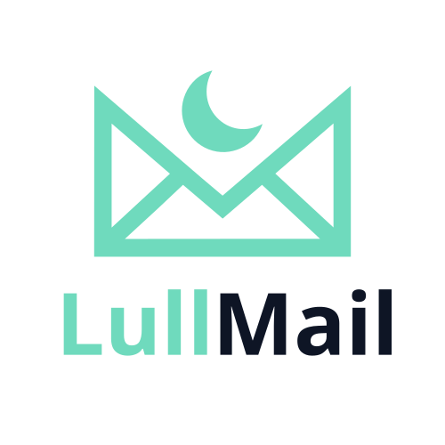

<picture>
  <source media="(prefers-color-scheme: dark)" srcset="frontend/assets/lullmail-logo-dark.svg">
  
</picture>

> **Your inbox, on mute.**
> Silent by default. Notification by exception. Your data stays yours.

You get 80 emails a day. Three of them actually matter.

Lull Mail sits between your mail accounts and you. It reads everything
that comes in, picks out the three or four messages that genuinely
deserve your attention, summarises them in two lines, and sends *one*
notification — the right one, at the right moment. The rest waits
until you have time. Or quietly disappears.

> **Note**: Lull Mail runs on Windows 10/11. The Python code is
> cross-platform — only the desktop packaging is Windows-only for now.

 

---

## Download

Head to the **[Releases](../../releases/latest)** page and grab
`LullMail-Setup-X.Y.Z.exe`. Double-click to install.

> ⚠️ **First launch & SmartScreen.** The installer is not yet
> code-signed. Windows will show *"Windows protected your PC"* —
> click **More info → Run anyway**. This is expected for now;
> code signing will come once the project has built up some track
> record.

The installer drops the app in `%LOCALAPPDATA%\Programs\LullMail`
(no admin prompt). It creates a desktop shortcut, a Start Menu entry,
and registers the app in *Installed apps* for clean uninstallation.

---

## What Lull Mail does

- **Reads for you.** Every email gets classified (important,
  transactional, newsletter, promo, spam) and summarised in two
  lines. Importance score from 1 to 10. You see at a glance which
  message deserves three minutes and which deserves three seconds.

- **Pushes without bothering you.** A push notification only fires
  when something genuinely urgent lands. For everything else,
  radio silence. Your phone gets to be a phone again.

- **Cleans up continuously.** Detects newsletters you haven't read
  in months. Spots the unsubscribe link in one click. Suggests
  automatic rules: move, mark read, delete.

- **Multi-account.** Gmail, Outlook/Microsoft 365, iCloud, Yahoo,
  ProtonMail (via Bridge), and any standard IMAP server.

- **Lives on your machine.** No cloud, no SaaS, no account to create
  with us. It's a `.exe` that talks straight to your IMAP servers.

---

## What Lull Mail is NOT

- **Not a new email client.** Keep using Outlook, Gmail Web, Apple
  Mail. Lull Mail works alongside them, read-only on your mailboxes
  (unless you authorise it to apply rules).

- **Not a new address.** It plugs into your existing accounts.

- **Not a cloud.** Your IMAP credentials never leave your machine.
  See [Privacy](#privacy) below.

---

## Quick start

1. Download and run the installer.
2. The setup wizard opens:
   - **Step 1** — paste your OpenAI API key
     ([create one here](https://platform.openai.com/api-keys),
     ~$0.15 per 100 emails analysed with `gpt-4o-mini`).
   - **Step 2** — add your mail accounts. For Gmail / Yahoo /
     iCloud, a *"Create an app password"* button takes you straight
     to the right page.
   - **Step 3** — *(optional)* enable push notifications via
     [ntfy.sh](https://ntfy.sh): free, no account, anonymous.
   - **Step 4** — done.
3. The first sync may take a few minutes depending on the size
   of your mailboxes.

The app lives in the system tray. Closing the window doesn't quit it
— right-click the tray icon → `Quit` to exit.

---

## Privacy

Lull Mail is built around a simple principle: **what can stay on
your machine, stays on your machine.**

| Data | Where it lives |
|---|---|
| IMAP credentials (app password) | OS keyring (Windows Credential Manager / macOS Keychain / Linux Secret Service). `config.yaml` only holds an opaque `keyring:user@host` reference. |
| OpenAI API key | OS keyring (same as above). |
| Downloaded emails, summaries, scores | `%APPDATA%\LullMail\data\mail.db` (local SQLite) |
| Attachments | `%APPDATA%\LullMail\data\attachments\` (UUID filenames, owner-only on POSIX, integrity-checked on every download) |

**The only outbound flows**:

- **OpenAI** — every email's text (subject + body) gets sent for
  analysis. That's the smart-sort engine. Configurable: you can
  disable AI analysis for specific mailboxes or change the model.
- **ntfy.sh** — *(optional)* push notification title (email subject
  + summary excerpt) is sent to the anonymous topic you choose.
  No link to your identity.
- **Your provider's IMAP** — to fetch your email. Direct, no
  middleman.

**Erase everything**: *Settings → Storage → Delete my data* wipes
config + SQLite + attachments + keyring entries in one click.

**Anti-phishing & sandbox**: emails are rendered in a sandboxed
iframe that **never executes JavaScript**, remote images are
**blocked by default** (per-sender opt-in), suspicious links
(homograph, punycode IDN, userinfo trick, raw IP, shorteners,
suspicious TLDs, typosquat, subdomain spoofing) route through a
warning page before opening, and SPF/DKIM/DMARC verdicts are
surfaced as a coloured badge on every email. See
[`docs/SECURITY-ROADMAP.md`](docs/SECURITY-ROADMAP.md) for what is
still planned (E2E PGP, AV system integration, local LLM, signed
installer).

---

## Quick FAQ

**How much does it cost?**
Lull Mail is free. You pay OpenAI for usage (~$0.15 / 100 emails).
ntfy.sh is free too.

**Does it work offline?**
Yes for browsing what's already synced. No for IMAP fetching or AI
analysis — those are network calls.

**Can I drop it overnight?**
Yes. Lull Mail doesn't write to your servers (read-only by default)
and registers nowhere. Uninstall it, delete `%APPDATA%\LullMail`,
no trace left.

**Why Windows only?**
For now packaging and testing are Windows-first. The Python code is
cross-platform and a macOS / Linux build is doable (see
[`docs/DEVELOPING.md`](docs/DEVELOPING.md) if you want to try).

**Which languages?**
Lull Mail follows the Windows display language: French if your system
is French, English otherwise. The setup wizard and the navigation
chrome are fully translated. The deeper screens (inbox, cleanup,
settings) are still French in v0.3.0 — full English translation is
slated for v0.4.0. To force a language manually, append `?lang=en` or
`?lang=fr` to the URL.

**Are my IMAP passwords stored in plain text?**
No. They live in the OS keyring (Windows Credential Manager / macOS
Keychain / Linux Secret Service). `config.yaml` only carries an
opaque `keyring:user@host` reference; the real secret is fetched in
memory at runtime. For Gmail / Outlook / Yahoo / iCloud you should
still use an *app password* — easier to revoke than your main
account password if anything goes wrong.

---

## Report a bug or request a feature

[Open an issue](../../issues/new/choose).

---

## For developers

See [`docs/DEVELOPING.md`](docs/DEVELOPING.md) — local setup,
developer mode (console + browser), exe build, installer build,
architecture, environment variables.

The product tone and positioning is documented in
[`docs/MARKETING.md`](docs/MARKETING.md).

---

## Licence

To be defined.
